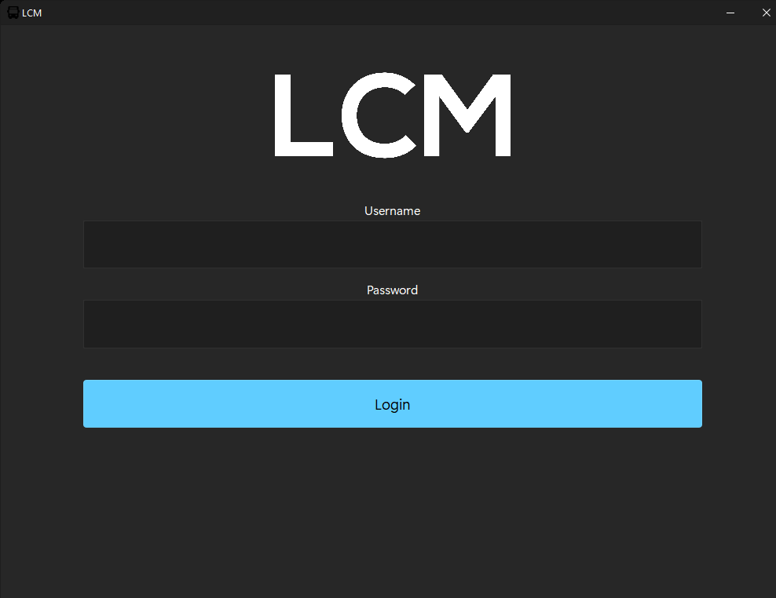
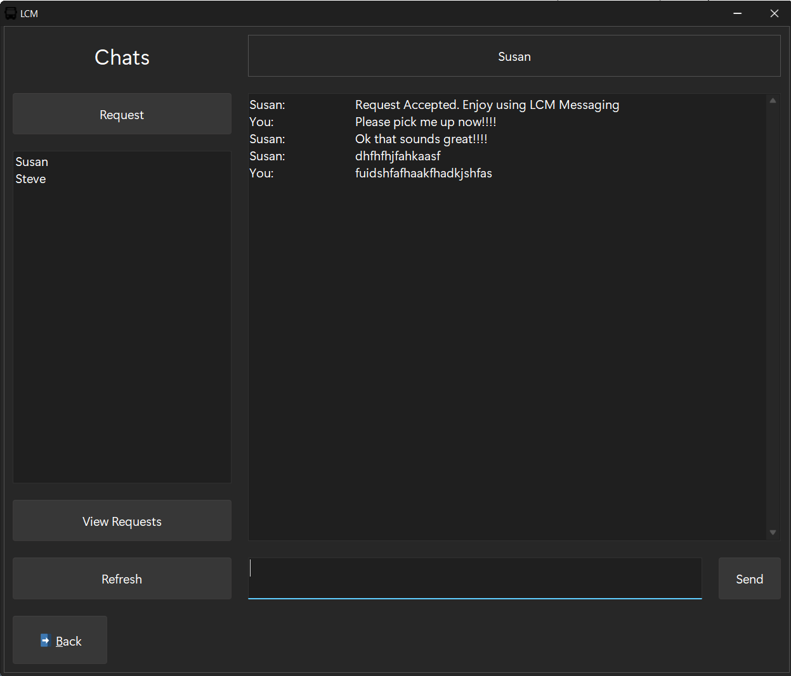
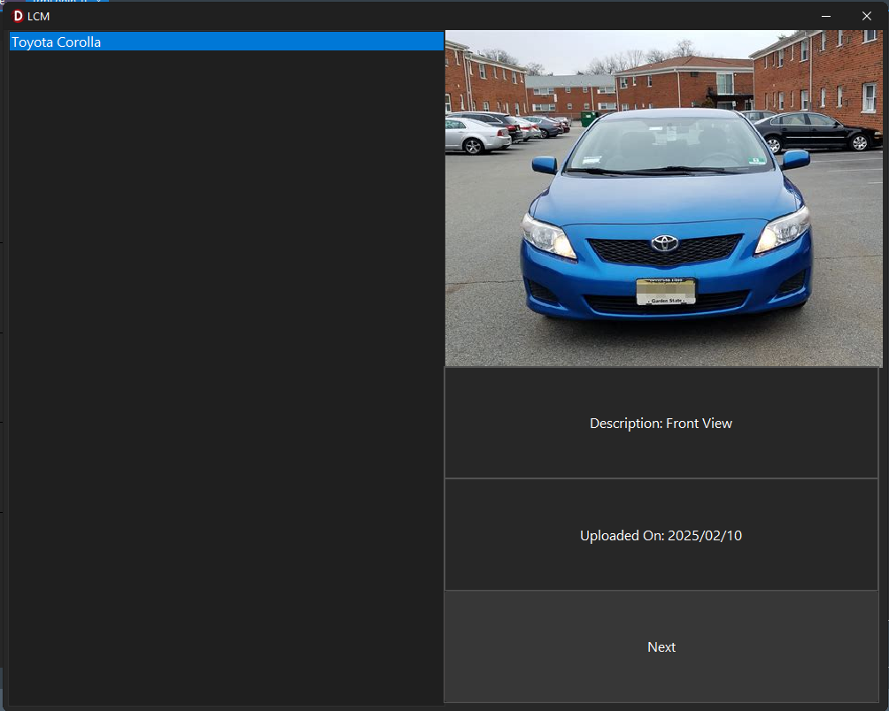

# LCM 

LCM is a lift club service application, transporting high school students to and from school daily.

## Get Started
In the main directory of the repository, there is a folder named "Sample Data." First, delete all the contents of the "Win32/Debug" folder. Then, copy the contents of the "Sample Data" folder into "Win32/Debug/" if the "Win32" folder does not exist already. You need to run the application once for the "Win32" folder to be created.

LCM App Icon Resource: https://www.flaticon.com/free-icons/bus